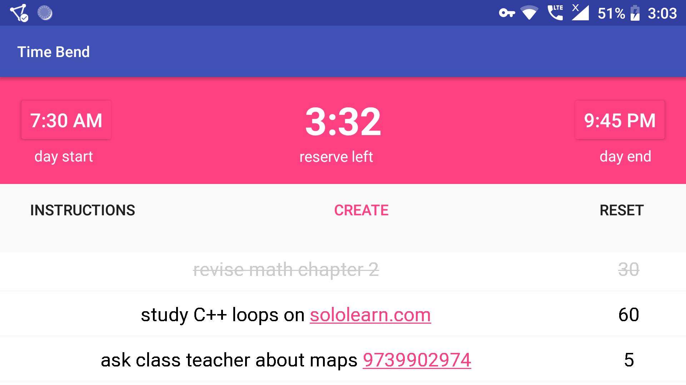

# Time Bend Android

This is a native Android application written in Java to get everything done and more using Chetan Surpur's technique of [time bending](http://chetansurpur.com/blog/2012/10/time-bending.html). [Here](https://neelkamath.notion.site/time-bend-native-android-app-demo)'s the demo.

# Installation

## Prerequisites

- [Android Studio](https://developer.android.com/studio/index.html)

## Installing

Clone the repository using one of the following methods.
- HTTPS: `git clone https://github.com/neelkamath/time-bend-android.git`
- SSH: `git clone git@github.com:neelkamath/time-bend-android.git`

# Usage

1. Open `time-bend-android` in Android Studio.
1. Click **Run > Run 'app'**.
1. [Run](https://developer.android.com/training/basics/firstapp/running-app) the app.

# Documentation

## `SharedPreferences`

|File|Explanation|Mode|
|----|-----------|----|
|`times`|The start and end of the user's day in 24 hour format.|[`Context.MODE_PRIVATE`](https://developer.android.com/reference/android/content/Context.html#MODE_PRIVATE)|

### `times`

|Key          |Data type|Explanation                  |Example|
|-------------|---------|-----------------------------|-------|
|`startHour`  |`int`    |Hour of start of user's day  |6      |
|`startMinute`|`int`    |Minute of start of user's day|30     |
|`endHour`    |`int`    |Hour of end of user's day    |21     |
|`endMinute`  |`int`    |Minute of end of user's day  |0      |

## Database

The Room abstraction layer is used and the database's name is `"production"`.

### Tables

#### `activities`

|column        |datatype|explanation                                    |example |
|--------------|--------|-----------------------------------------------|--------|
|`id`          |`int`   |the auto generated primary key                 |`1`     |
|`activity`    |`char`  |the activity's text                            |`"yoga"`|
|`duration`    |`int`   |the duration of the activity                   |`20`    |
|`is_completed`|`bit`   |`1` if the activity has been completed else `0`|`0`     |

# License

This project is licensed under the [MIT License](LICENSE).
